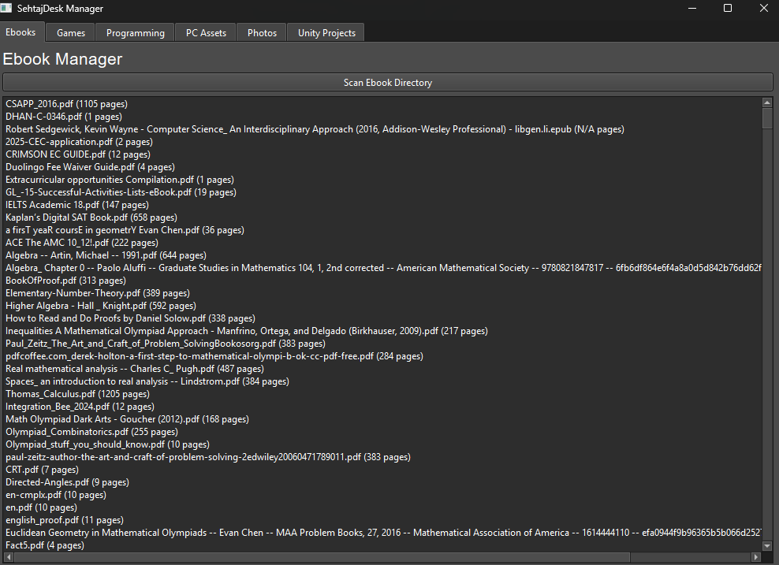

# SehTajDesk

SehTajDesk is a project designed to help me manage files on my pc. This README provides an overview of the project, setup instructions, and usage guidelines.(The name is based on my friend :p)

## Features

- Ebook management
- Game Management(executeable)
- Programming Project Management 

## Screenshots




## Installation

1. Clone the repository:
    ```bash
    git clone https://github.com/your-username/SehTajDesk.git
    ```
2. Navigate to the project directory:
    ```bash
    cd SehTajDesk
    ```

## Usage

1. Install dependencies:
    ```bash
        pip install -r requirements.txt
    ```
2. Run
    ```
    python3 main.py
    or py main.py
    ```

## Contributing

Contributions are welcome! Please follow these steps:

1. Fork the repository.
2. Create a new branch:
    ```bash
    git checkout -b feature-name
    ```
3. Commit your changes:
    ```bash
    git commit -m "Description of changes"
    ```
4. Push to the branch:
    ```bash
    git push origin feature-name
    ```
5. Open a pull request.

## License

This project is licensed under the [License Name]. See the [LICENSE](LICENSE) file for details.

## Contact

For questions or feedback, please throw me a dm
