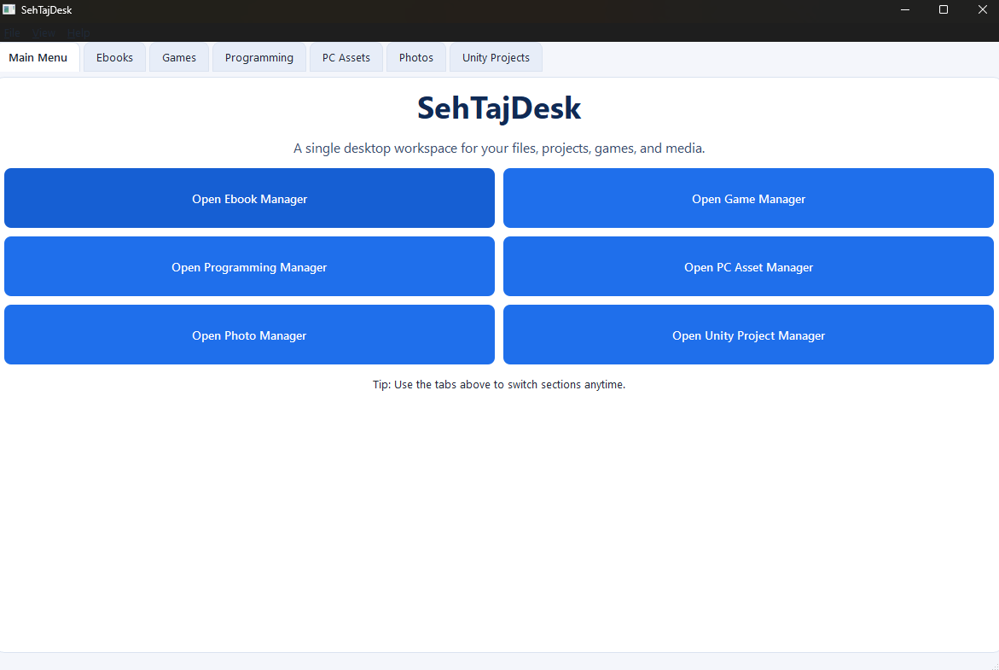

# SehTajDesk

SehTajDesk is a Windows desktop hub built with PyQt6 to manage ebooks, projects, games, assets, photos, and Unity workflows in one place.

## Why SehTajDesk

- Single app for everyday desktop workflows
- Fast scanning with large-directory safety limits
- List View and Grid View modes with category icons
- Main Menu landing screen for quick navigation
- Built-in EXE build script for simple distribution

## Features

### Main Menu
- App landing screen with title and one-click navigation to each manager

### Ebook Manager
- Scan folders for PDF, EPUB, and TXT files
- View page counts for PDFs
- Remove missing entries from cache

### Programming Manager
- Scan project folders and detect extension summaries
- Open project directories directly

### Game Manager
- Save game executables and launch from a list

### PC Asset Manager
- Index files in a selected directory tree
- Auto category icons for common file types

### Photo Manager
- Scan and browse image files quickly

### Unity Project Manager
- Set Unity Editor path
- Discover Unity projects and launch directly

### UX and Accessibility
- Search/filter on lists
- List View / Grid View switch
- Context menu actions: open, open containing folder, copy path
- Keyboard-friendly controls and status bar feedback

## Screenshots

## Tech Stack

- Python 3.10+
- PyQt6
- PyMuPDF

## Requirements

- Windows 10/11
- Python 3.10 or newer

Note: The app uses os.startfile, so Windows is currently required.

## Quick Start

1. Clone the repo

   git clone https://github.com/your-username/SehTajDesk.git
   cd SehTajDesk

2. Optional virtual environment (PowerShell)

   python -m venv .venv
   .\.venv\Scripts\Activate.ps1

3. Install dependencies

   pip install -r requirements.txt

4. Run

   py main.py

## Build EXE (Windows)

Use the included script:

   .\build_exe.ps1

Useful options:

   .\build_exe.ps1 -OneFile
   .\build_exe.ps1 -Clean

If script execution is blocked:

   Set-ExecutionPolicy -Scope Process -ExecutionPolicy Bypass

Build output:

- One-dir: dist\SehTajDesk\SehTajDesk.exe
- One-file: dist\SehTajDesk.exe

## Project Structure

- main.py: Main application code
- build_exe.ps1: EXE build automation script
- requirements.txt: Python dependencies
- ebook_cache.json: Local ebook cache (generated)

## Local Runtime Files

The app creates local state files while running:

- ebook_cache.json
- games.json
- unity_editor_path.txt

These are ignored in source control.

## Roadmap

- Persistent view preferences per tab
- Background worker threads for all long scans
- Optional thumbnail previews for photos and ebooks
- Linux/macOS launcher support

## Contributing

Contributions are welcome.

1. Fork the repository
2. Create a feature branch
3. Make your changes
4. Open a pull request

## License

This project is licensed under GNU GPL v3.0.
See [LICENSE](LICENSE).
